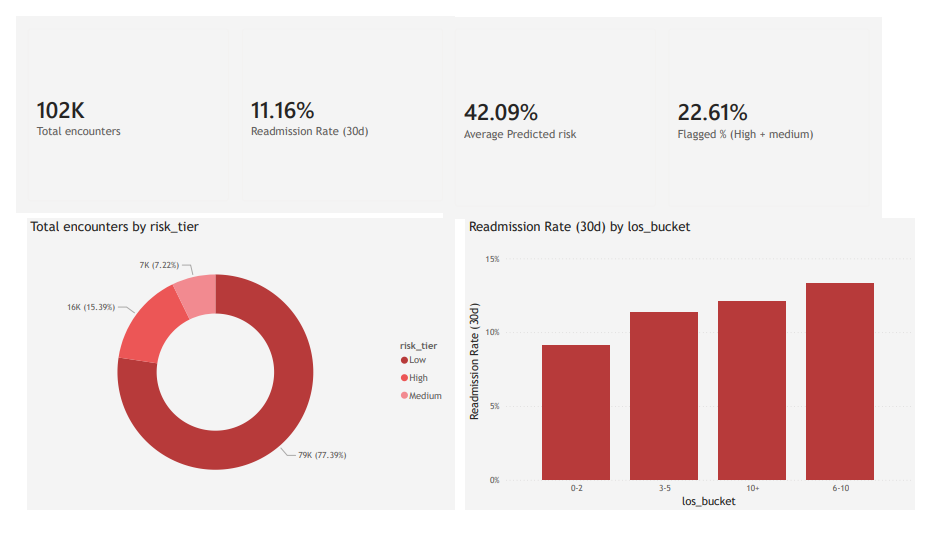
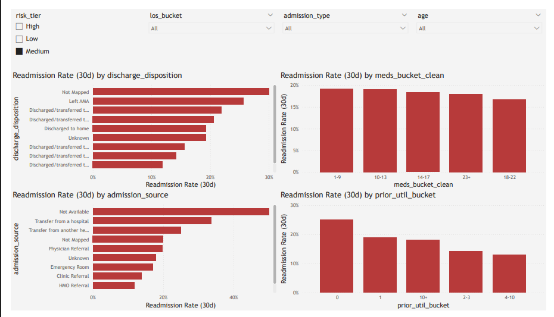
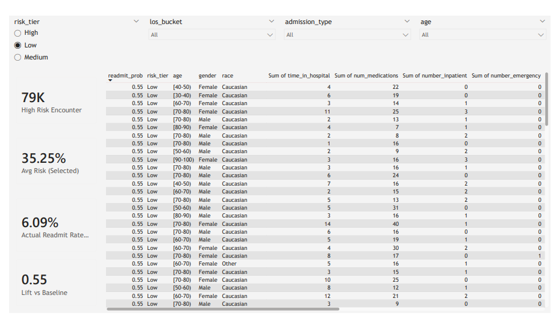

# Hospital Readmission Risk Dashboard (30-Day)

This project predicts **30-day hospital readmission risk** and provides a **Power BI dashboard** for actionable decision support.  
Pipeline: **Data cleaning → ID decoding → EDA → Feature engineering → Modeling (XGBoost) → Risk tiers → Dashboard**

> ⚠️ Educational analytics project for decision-support demonstration only (not medical advice).

---

## What this project does (in simple terms)
- Takes historical hospital encounter data (each row = one hospital visit)
- Builds a target: **Readmitted within 30 days (Yes/No)**
- Learns risk patterns using machine learning (XGBoost)
- Outputs a **risk probability** and **risk tier** (Low / Medium / High)
- Shows everything in a **Power BI report**:
  - Overview KPIs
  - Key drivers (what correlates with readmission)
  - High-risk encounter list sorted by risk score

---

## Dashboard Preview
### Overview


### Drivers


### High-Risk List


---

## Data used (what files mean)
### Raw inputs
- **`diabetic_data.csv`**  
  Main encounter dataset (demographics, utilization, labs, meds, admission/discharge/source IDs, readmission label).
- **`IDS_mapping.csv`**  
  Lookup table to decode:
  - admission type
  - discharge disposition
  - admission source
> Note: The repository focuses on the end-to-end workflow, modeling, and dashboard.  
> Data files are excluded from version control.


### Generated outputs
- **`master_readmission_dataset.csv`**  
  Clean master table with decoded labels + `readmit_30` target.
- **`hospital_readmission_model_ready.csv`**  
  Modeling dataset with selected features + engineered fields (leakage removed).
- **`pbi_patient_risk_scores_ALL.csv`**  
  Risk scores + tiers for all encounters used by Power BI.
- **`best_readmission_model.pkl`**  
  Saved trained model (XGBoost).

---

## Method overview (how it works)
### 1) Target creation
`readmit_30 = 1` if readmission status is `<30`, else `0`.

### 2) Feature engineering (examples)
- **Prior utilization total** = inpatient + ER + outpatient visits  
- Medication burden buckets / high meds flag  
- LOS bucket (for reporting and dashboards)

### 3) Modeling
- Baseline: Logistic Regression (balanced)
- Final: **XGBoost** (selected by PR-AUC improvement)
- Since readmissions are imbalanced (~11%), evaluation focuses on:
  - **PR-AUC**
  - **Recall**
  - thresholding by intervention capacity

### 4) Risk tiers (actionable output)
Encounters are categorized:
- **High / Medium / Low** using probability thresholds
- Power BI uses these tiers to filter and rank high-risk cases

---

## Repository structure


```text
hospital-readmission-risk-dashboard/
├── notebooks/
│   ├── 1_Merge_data.ipynb
│   ├── 2_EDA.ipynb
│   ├── 3_feature_engineering.ipynb
│   └── 4_Modeling.ipynb
├── data/   # not included (dataset not uploaded)
├── dashboard/
│   └── Hospital_readmission_risk_dashboard.pbix
├── images/
│   ├── overview.png
│   ├── drivers.png
│   └── high_risk_list.png
├── output/  # optional 
│   ├── best_readmission_model.pkl
│   └── pbi_patient_risk_scores_ALL.csv
└── README.md
