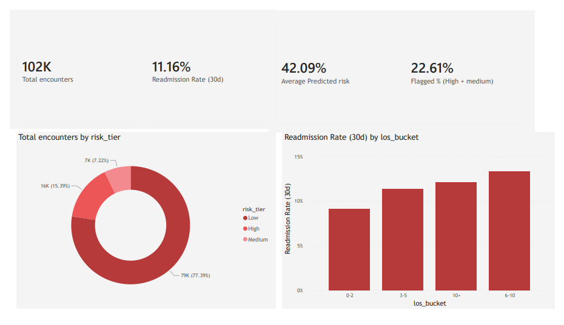
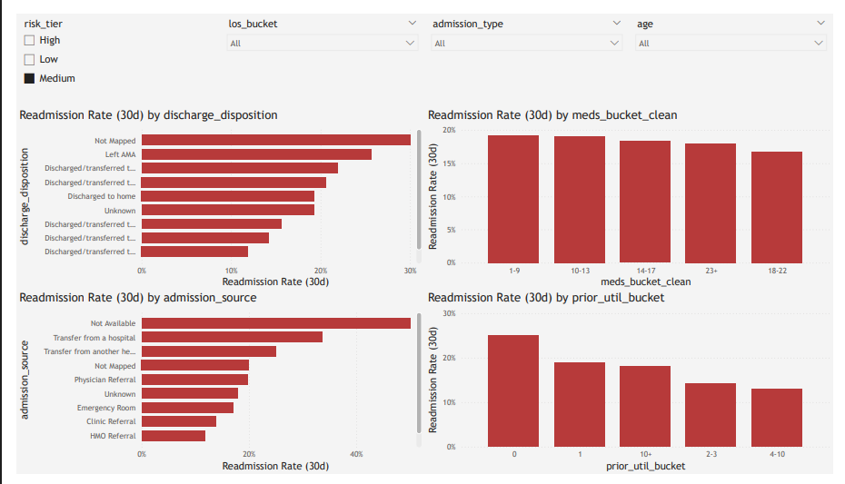
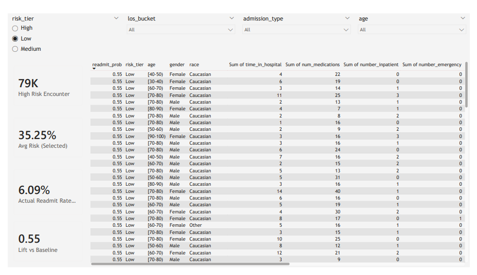

# 🏥 Hospital Readmission Risk Dashboard (30-Day)

> **Can we identify high-risk patients before they leave the hospital — and give care teams a tool to act on it?**

This project builds an end-to-end machine learning pipeline that predicts 30-day hospital readmission risk from historical encounter data, then surfaces actionable insights through a Power BI dashboard designed for clinical operations teams.

---

## 📊 Key Results

| Metric | Value |
|---|---|
| Model | XGBoost (PR-AUC optimized) |
| High + Medium risk queue | 22.6% of encounters |
| Readmissions captured in queue | 42.3% of all 30-day readmits |
| Precision in risk queue | 20.9% (vs 11.2% baseline) |
| Missed high-risk discharges | Significantly reduced via tiered triage |

> **Business impact:** Care teams can now focus follow-up calls on a manageable 22.6% queue that contains nearly half of all true readmissions — nearly doubling baseline precision.

---

## 🔍 The Problem

Hospital readmissions within 30 days are costly (penalized under CMS) and often preventable. The challenge: identifying *which* patients are truly high-risk at discharge, before limited care coordinator resources are spread too thin.

**Without a model**, teams either follow up with everyone (inefficient) or no one (high risk). This project builds the middle ground — a risk tier system that concentrates intervention where it matters most.

---

## 🔄 Pipeline Overview

```
Raw encounter data
       ↓
  Data cleaning + ID decoding (admission type, discharge disposition, source)
       ↓
  Exploratory data analysis
       ↓
  Feature engineering (utilization burden, medication load, LOS buckets)
       ↓
  Modeling — Logistic Regression baseline → XGBoost final
       ↓
  Risk scoring + tier assignment (Low / Medium / High)
       ↓
  Power BI dashboard for clinical ops
```

---

## 💡 Key Findings

- **Medication burden** is among the strongest drivers of readmission risk — patients on complex regimens need structured discharge planning
- **Prior utilization** (inpatient + ER + outpatient visits combined) is highly predictive — frequent utilizers are disproportionately likely to return
- **Discharge disposition** matters: patients discharged to home without support have elevated risk vs those discharged to skilled nursing facilities
- **Length of stay** alone is a weak predictor — utilization history and medication complexity carry more signal

---

## 📋 Business Recommendations

1. **Prioritize follow-up calls** for High + Medium tier patients within 48 hours of discharge
2. **Flag high medication burden** patients for pharmacist-led discharge counseling
3. **Use the Power BI High-Risk list** as the daily queue for care coordinators — sorted by risk score, filterable by discharge date and disposition
4. **Track precision over time** — as interventions reduce readmissions in the queue, retrain the model quarterly to maintain calibration

---

## 🖥️ Dashboard Preview

**Overview — KPIs and risk distribution**


**Key drivers — what correlates with readmission**


**High-risk encounter list — sorted by risk score**


> Dashboard built in Power BI. The `.pbix` file is included in `/dashboard/` — open with Power BI Desktop (free).

---

## 📁 Repository Structure

```
hospital-readmission-risk-dashboard/
├── notebooks/
│   ├── 1_Merge_data.ipynb           # Data loading, ID decoding, master table
│   ├── 2_EDA.ipynb                  # Distribution analysis, missing values, correlations
│   ├── 3_feature_engineering.ipynb  # Utilization features, med burden, LOS buckets
│   └── 4_Modeling.ipynb             # Baseline LR → XGBoost, threshold tuning, risk tiers
├── dashboard/
│   └── Hospital_readmission_risk_dashboard.pbix
├── images/
│   ├── overview.png
│   ├── drivers.png
│   └── high_risk_list.png
├── output/
│   ├── best_readmission_model.pkl
│   └── pbi_patient_risk_scores_ALL.csv
└── README.md
```

---

## 🗂️ Dataset

**Source:** [UCI Diabetes 130-US Hospitals Dataset](https://archive.ics.uci.edu/dataset/296/diabetes+130-us+hospitals+for+years+1999-2008) — 101,766 encounters across 130 US hospitals (1999–2008)

Data files are excluded from this repo to keep it lightweight. To run locally:

1. Download `diabetic_data.csv` and `IDS_mapping.csv` from the link above
2. Place them in the `/data/` folder
3. Update paths in the notebooks if needed:
```python
DATA_PATH = "data/diabetic_data.csv"
MAP_PATH  = "data/IDS_mapping.csv"
```

---

## 🛠️ Tech Stack

`Python` `pandas` `scikit-learn` `XGBoost` `matplotlib` `seaborn` `Power BI`

---

## ⚠️ Disclaimer

This is an educational analytics project built for decision-support demonstration purposes only. It is not intended for clinical use and does not constitute medical advice.
